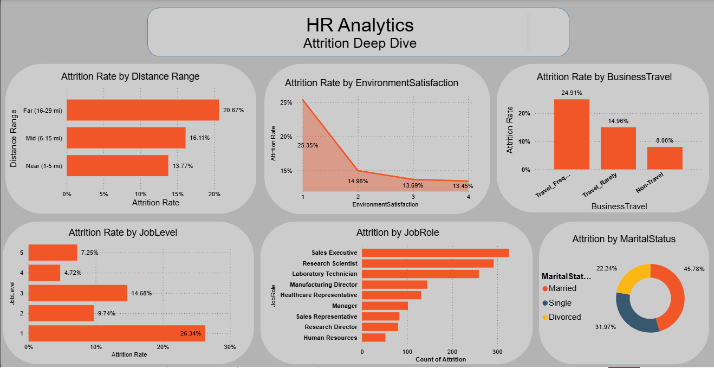
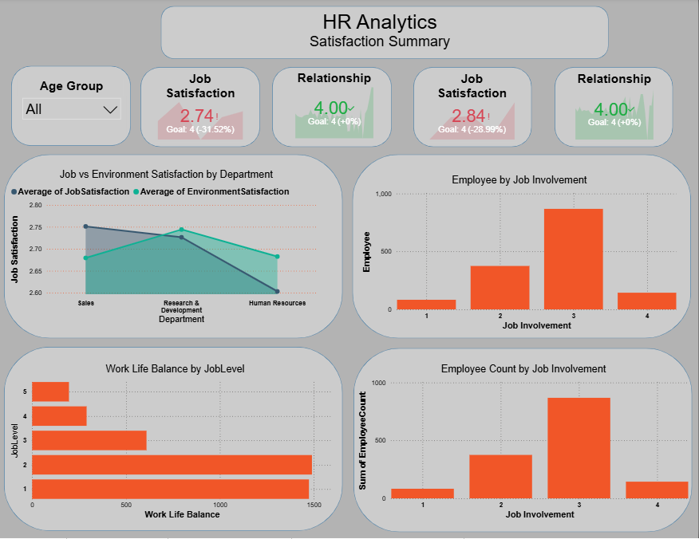

# HR Analytics Dashboard — Power BI

## Overview

An interactive Power BI report analyzing HR data for 1,470 employees across three dashboard pages to identify attrition drivers, employee satisfaction trends, and workforce patterns.

## Business Objective

The objective of this project is to help HR teams understand the factors contributing to employee attrition and engagement. By transforming HR data into actionable insights, the dashboard supports data-driven decisions related to employee retention, workforce planning, and organizational performance.

## Dataset Information

* Total Employees: 1,470
* Domain: Human Resources (HR)
* Key Areas: Attrition, Employee Satisfaction, Workforce Trends, Engagement
* Dashboard Pages: 3

## Dashboard Pages

### Executive Summary

* Key HR KPIs
* Overtime Analysis
* Education Field Analysis
* Job Level Analysis
* Years at Company Analysis

### Attrition Deep Dive

* Attrition by Job Role
* Distance from Home
* Business Travel
* Marital Status
* Environment Satisfaction

### Satisfaction & Engagement

* Job Satisfaction vs Environment Satisfaction
* Work-Life Balance
* Job Involvement
* Training Sessions Analysis

## Dashboard Preview

### Executive Summary

### Attrition Deep Dive

### Satisfaction & Engagement

## Key Insights

* Overall attrition rate reached **16.1%**, with higher turnover among entry-level employees and those working overtime.
* Frequent business travelers experienced an attrition rate of **24.91%**, compared to **8%** for non-travelers.
* Employees who had not received a recent promotion showed significantly higher attrition rates.
* Average job satisfaction scored **2.74/4** across departments, highlighting opportunities for engagement improvement.

## Tools & Skills

`Power BI` • `DAX` • `Data Modeling` • `HR Analytics` • `Data Visualization`

## Conclusion

This project demonstrates the ability to transform raw HR data into meaningful insights through data modeling, analysis, and visualization. The dashboard enables stakeholders to monitor workforce performance, identify attrition risks, and make informed decisions using interactive and data-driven reporting.
